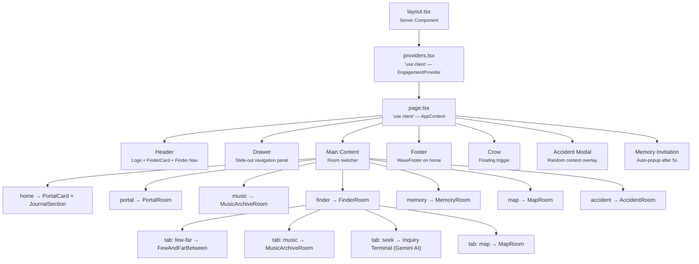

# Kaaktaal Web — Project Overview

## What is Kaaktaal?

**Kaaktaal** (কাকতাল — "coincidence" in Bengali) is a digital cultural archive — an immersive, museum-like web experience dedicated to a Bangladeshi musical/artistic project. The tagline is *"Coincidence & Serendipity."*

This is **not** a conventional website. It's an *experiential archive* where users navigate themed "rooms," each containing different content: music, stories, maps, memories, artwork, lyrics, and more.

> [!NOTE]
> The project was recently migrated from **Vite SPA → Next.js 16 App Router**. The source lives in `src/app/` with the App Router pattern.

---

## Architecture

### App Shell (Next.js App Router)

| File | Role |
|------|------|
| [layout.tsx](file:///c:/Web%20Design/Kaaktaal%20Web/Version%201.3/VIte%20SPA/src/app/layout.tsx) | Root **Server Component**. Sets metadata (title, favicon), imports global CSS, wraps children in `<Providers>` |
| [providers.tsx](file:///c:/Web%20Design/Kaaktaal%20Web/Version%201.3/VIte%20SPA/src/app/providers.tsx) | `'use client'` wrapper. Isolates `EngagementProvider` so layout stays server-side |
| [page.tsx](file:///c:/Web%20Design/Kaaktaal%20Web/Version%201.3/VIte%20SPA/src/app/page.tsx) | `'use client'` home page. Contains the full UI in `AppContent()` — room navigation, header, footer, drawer, overlays |
| [route.ts](file:///c:/Web%20Design/Kaaktaal%20Web/Version%201.3/VIte%20SPA/src/app/api/ask-gemini/route.ts) | API route. Calls **Google Gemini** (`gemini-3.5-flash`) to answer user questions about Kaaktaal songs in the persona of a "wise archivist" |

---

## The "Room" Navigation Pattern

Instead of traditional page routing, the app uses a **single-page room-switching pattern** controlled by an `activeRoom` state variable:

| Room | Component | What It Shows |
|------|-----------|---------------|
| `home` | `PortalCard` + `JournalSection` | Landing page — portal entrance and journal |
| `portal` | `PortalRoom` (86KB!) | Main hub — grid of song cards with detailed view panel |
| `music` | `MusicArchiveRoom` | Searchable/filterable song catalog with metadata |
| `finder` | `FinderRoom` (tabbed) | Multi-tab exploration room (see sub-tabs below) |
| `memory` | `MemoryRoom` | Interactive memory contribution — users submit stories |
| `map` | `MapRoom` | Full-page interactive SVG map of Bangladesh |
| `accident` | `AccidentRoom` | Dedicated "divine accidents" browsing room |

### Finder Sub-Tabs

| Tab | Content |
|-----|---------|
| `few-far` | "Few & Far Between" — curated thematic song collections |
| `music` | Music Catalogue (reuses `MusicArchiveRoom`) |
| `seek` | "Inquiry Terminal" — AI-powered Q&A via Gemini API |
| `map` | "Cartography Room" — interactive map view |

---

## The Engagement & Crow System

This is the app's **gamification/discovery mechanic** — core to the "coincidence" theme.

### Engagement Tracking

[EngagementProvider.tsx](file:///c:/Web%20Design/Kaaktaal%20Web/Version%201.3/VIte%20SPA/src/context/EngagementProvider.tsx) tracks user behavior via React Context + `localStorage`:

- **Metrics**: `timeSpent`, `visitedRooms`, `songsOpened`, `journalInteractions`, `finderUsage`, `mapClicks`
- **Unlock system**: Certain experiences unlock after enough engagement (e.g., Memory Room unlocks after visiting 3+ rooms and spending 120+ seconds)
- Consumed via the [useEngagement](file:///c:/Web%20Design/Kaaktaal%20Web/Version%201.3/VIte%20SPA/src/hooks/useEngagement.ts) hook

### The Crow

[Crow.tsx](file:///c:/Web%20Design/Kaaktaal%20Web/Version%201.3/VIte%20SPA/src/components/Crow.tsx) — A floating, animated crow icon that appears on Finder and Map pages. When clicked, it triggers a **"divine accident"**: a random item from `CROW_ACCIDENTS` displayed in a modal overlay.

### Crow Accidents (Serendipitous Encounters)

~40+ accident objects in [data.ts](file:///c:/Web%20Design/Kaaktaal%20Web/Version%201.3/VIte%20SPA/src/data.ts), each with a type that renders differently:

| Type | Renders As |
|------|-----------|
| `song` | Album art + title + description |
| `lyric` | Bengali text + English translation, centered |
| `story` | "Vault Lore Log" — dashed-border story card |
| `artwork` | Featured artwork with image |
| `journal` | Typewriter-styled note on dot-grid paper |
| `memory` | Show memory with border-left accent |
| `unpublished` | "Vault Restricted" — red-tinted unreleased content |
| `interpretation` | Fan interpretation with "Wrong interpretation" verdict |
| `question` | Interactive prompt with textarea for user reflection |

---

## Data Layer

| File | Contents |
|------|----------|
| [data.ts](file:///c:/Web%20Design/Kaaktaal%20Web/Version%201.3/VIte%20SPA/src/data.ts) (17KB) | `PORTAL_SONGS` (songs with title, year, genre, mood, cover art URLs), `CROW_ACCIDENTS` |
| [few-and-far-between.ts](file:///c:/Web%20Design/Kaaktaal%20Web/Version%201.3/VIte%20SPA/src/data/few-and-far-between.ts) (12KB) | Curated thematic song collections (e.g., "Songs of Dhaka") |
| [audience-meanings.ts](file:///c:/Web%20Design/Kaaktaal%20Web/Version%201.3/VIte%20SPA/src/data/audience-meanings.ts) (5KB) | Listener-submitted song interpretations |
| [song-versions.ts](file:///c:/Web%20Design/Kaaktaal%20Web/Version%201.3/VIte%20SPA/src/data/song-versions.ts) (8KB) | Different recordings of songs (live, demo, studio) |

---

## Key Types ([types.ts](file:///c:/Web%20Design/Kaaktaal%20Web/Version%201.3/VIte%20SPA/src/types.ts))

```typescript
ActiveRoom = 'home' | 'portal' | 'music' | 'finder' | 'memory' | 'map' | 'accident'
FinderTab  = 'music' | 'few-far' | 'seek' | 'map'
Song       = { id, title, year, genre, mood, description, coverUrl, bengaliTitle?, lyrics?, story? }
CrowAccident = { type, title, content, image?, bengali?, subtext? }
```

---

## Design Language

| Aspect | Details |
|--------|---------|
| **Theme** | Archival / typewriter / paper aesthetic — brutalist meets museum |
| **Background** | Off-white `#F8F7F4` |
| **Text** | Near-black ink `#111113` |
| **Accent** | Red `#d31a1a` |
| **Typography** | Inter (body), Syne (headings), BD Plakatbau (display/brand), Space Mono (mono labels), EB Garamond (serif), Courier Prime |
| **Labels** | Heavy use of `font-mono text-[8px] uppercase tracking-widest` — tiny monospace labels everywhere |
| **Animations** | Framer Motion throughout — page transitions, drawer slides, modal overlays, hover effects, bobbing crow |
| **Assets** | All images hosted on GitHub (`raw.githubusercontent.com/mehediforsure/kaaktaal_assets/`), optimized through [wsrv.nl CDN](file:///c:/Web%20Design/Kaaktaal%20Web/Version%201.3/VIte%20SPA/src/utils/image.ts) |
| **Styling** | Tailwind CSS v4 with custom `@theme` tokens |

---

## Component Tree



---

## External Dependencies

| Dependency | Purpose |
|------------|---------|
| `next` 16.2.10 | Framework (App Router) |
| `react` / `react-dom` 19 | UI library |
| `motion` (Framer Motion) | Animations |
| `lucide-react` | Icons (Menu, X, ArrowLeft, etc.) |
| `@google/genai` | Gemini AI SDK for the inquiry terminal |
| `html-to-image` | Screenshot/share card generation |
| `tailwindcss` v4 + `@tailwindcss/postcss` | Styling |

## Environment Variables

From `.env.example`:
- `GEMINI_API_KEY` — Required for the AI inquiry terminal
